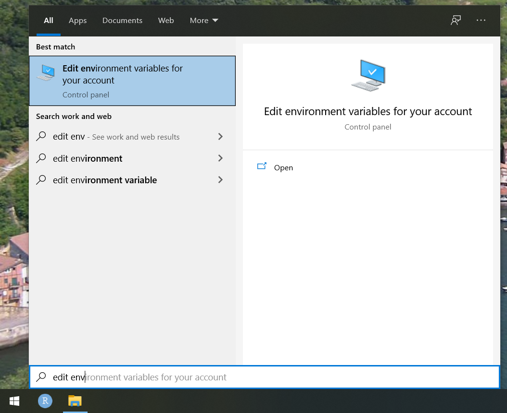
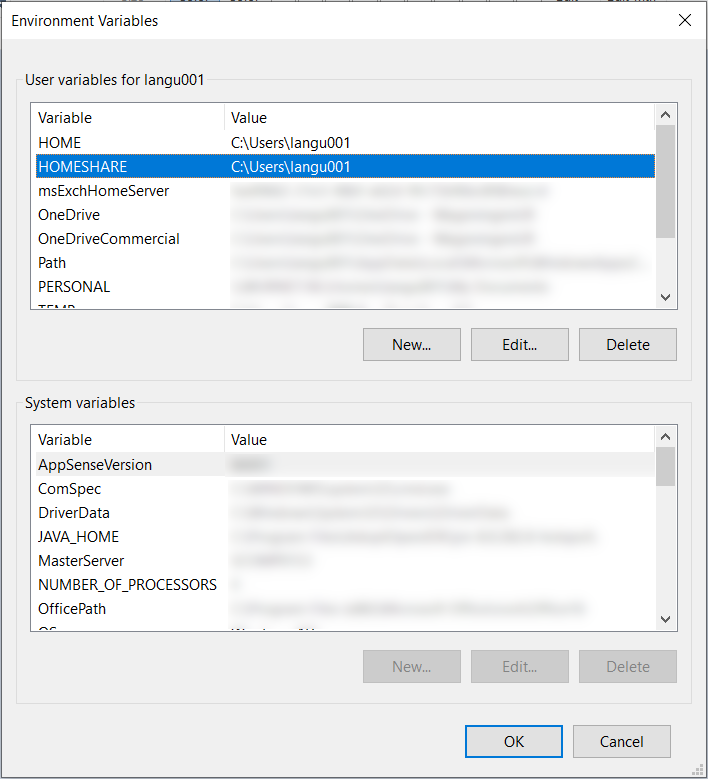
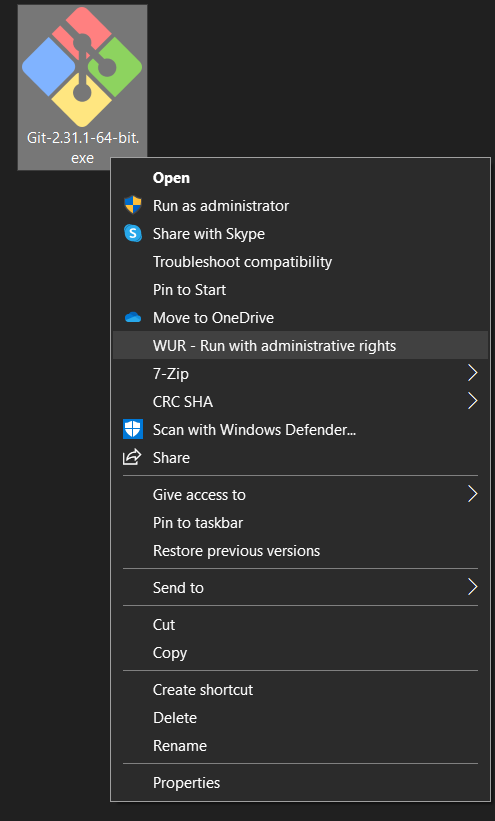
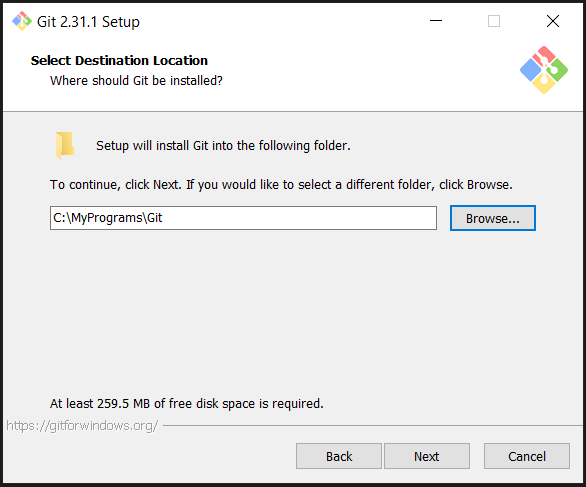
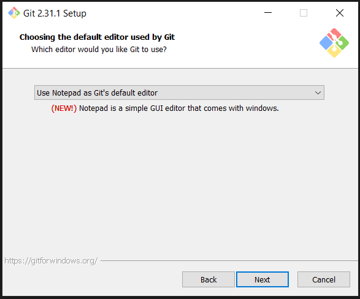
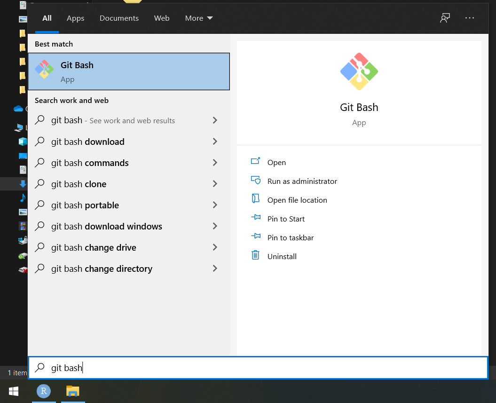
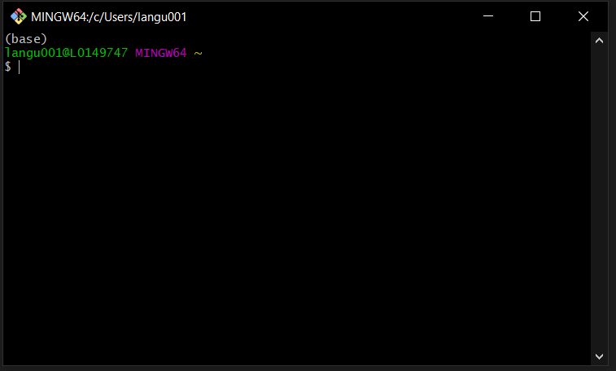
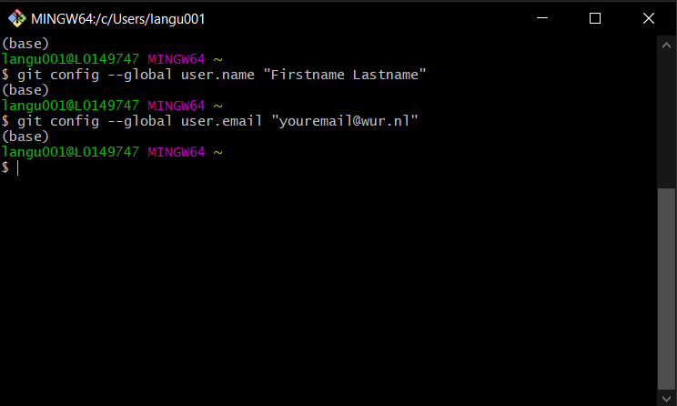

Install git on a WUR W10 computer
================

It is possible for WUR students and employees to install git directly
via the **Software Center** (formerly **!Available Software**). However,
this can cause all kinds of issues when you are not directly plugged on
the physical WUR network. To avoid any unjustified headaches, read on
and follow the instructions.

## Prerequisites

-   A minute amount of your awake time. Relax it should be easy and
    quick.
-   **A WUR laptop or desktop with power user rights**. This enables you
    to run program installers with administrative rights simply by
    right-clicking on the .exe installer and selecting *WUR - Run with
    administrative rights*. If you have a WUR laptop it should be the
    default option, if not you will have to call IT, so that they will
    grant you that privilege.
-   A working internet connection to download git installer.

## Outline

1.  First, we will make sure to set up a HOME variable so that git will
    find its configuration file. If we don’t do that your .gitconfig
    file will end up dangling on your remote M drive. If you are to
    install git on your personal Windows laptop you should be able to
    skip that.
2.  Second, we will install git manually by passing WUR Software center.
3.  Third, we will introduce ourselves to Mister git so that he will
    recognize us.

Let’s get started !

## 1. Set up HOME environment variable

Alrighty then, to get started open Windows start up Menu and look for
*Edit environment variables for your account*.

The following window will pop up. Note that in your the HOME variable
will not be defined yet. So let’s define it by clicking on *Edit…*

Then add a **HOME** as *Variable name* and
**C:&lt;your-wur-username&gt;** as *Variable value*.

> Of course make sure to replace <your-wur-username> by your wur
> username i.e. janss001.

Boom eh voilà, we are done with point 1.

## 2. Install git

Next we need to grab a fresh git installer. Easiest thing in the world,
just go [there](https://git-scm.com/download/win).

Once the exe file downloaded, just navigate to it and right click on it.
Then choose the option *WUR - Run with administrative rights*.

|                                                                                                                                                                                                                                                                        |
|------------------------------------------------------------------------------------------------------------------------------------------------------------------------------------------------------------------------------------------------------------------------|
| **WARNING !**                                                                                                                                                                                                                                                          |
| Attention folks, the default git installation settings are just fine. The installation process will be mostly clicking *Next* repeadtely. EXCEPT for the two panes **Select Destination Location** and **Choosing the default editor used by Git**. So beware friends. |

### Select Destination Location

Make sure to install git within **`C:\MyPrograms\Git`** and not
`C:\ProgramFiles\Git`.

### Choosing the default editor used by Git

Make sure to select **Notepad** as git default editor.

You can then peacefully press Next and proceed to the end of the
installation.

## 3. Introduce yourself to Mister git

Last step ! We just need to introduce ourselves to git.

To do so we will open **Git Bash**. Just look for Git Bash in your start
up menu.

Then you should see a black window popping up. This is might feel like
you are peeking into the Matrix but no need to be afraid friends. It is
a really straightforward tool to use.

We just need to tell git who we are. So essentially what’s our name
(**user.name**) and our email address (**user.email**).

We can do that by simply typing those two commands:

> For the ones who would like to copy/paste those two lines the usual
> Ctrl+V won’t work in Git Bash instead use Shift+Insert.

-   `git config --global user.name "Firstname Lastname"`
-   `git config --global user.email "yourwuremail@wur.nl"`

> And of course, do not forget to fill in your own first name, last name
> and WUR email.

If you the previous command succeed you should not observed any ouput.

You should be all set by now. To check if git knows you, you can run:

`git config --global --list`

If everything worked well, your user.name and user.email will be printed
in the terminal.

We are done and ready to use git. See you online for the workshop.
